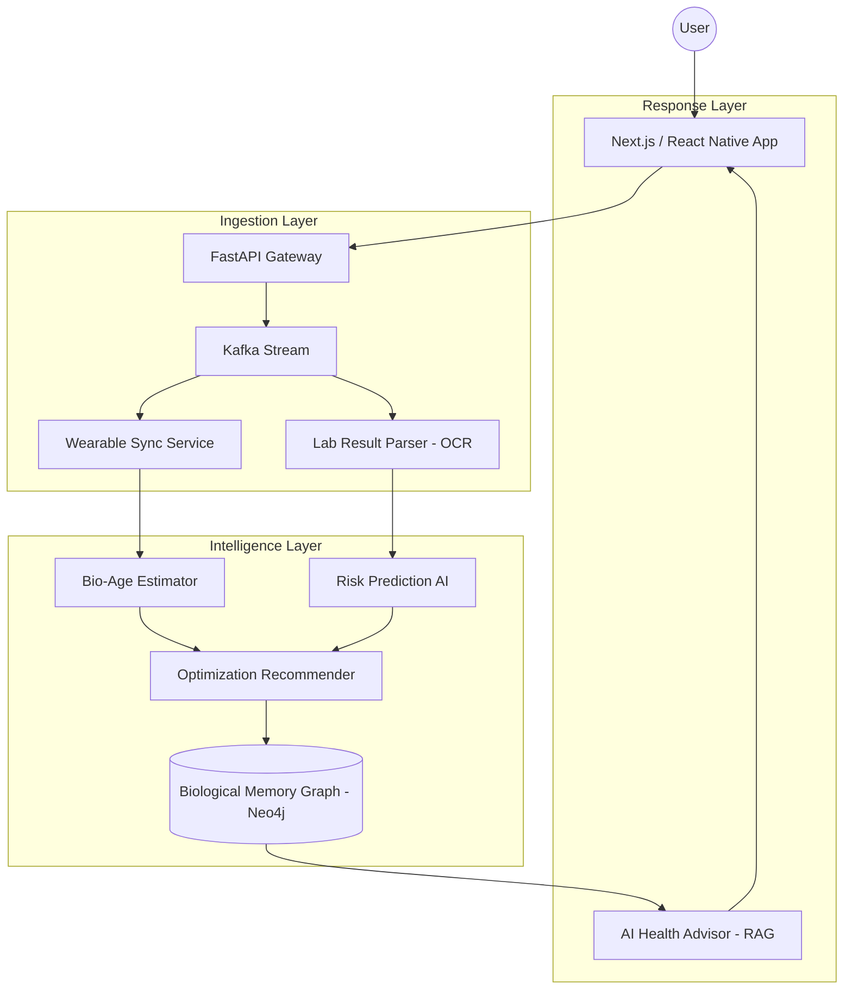
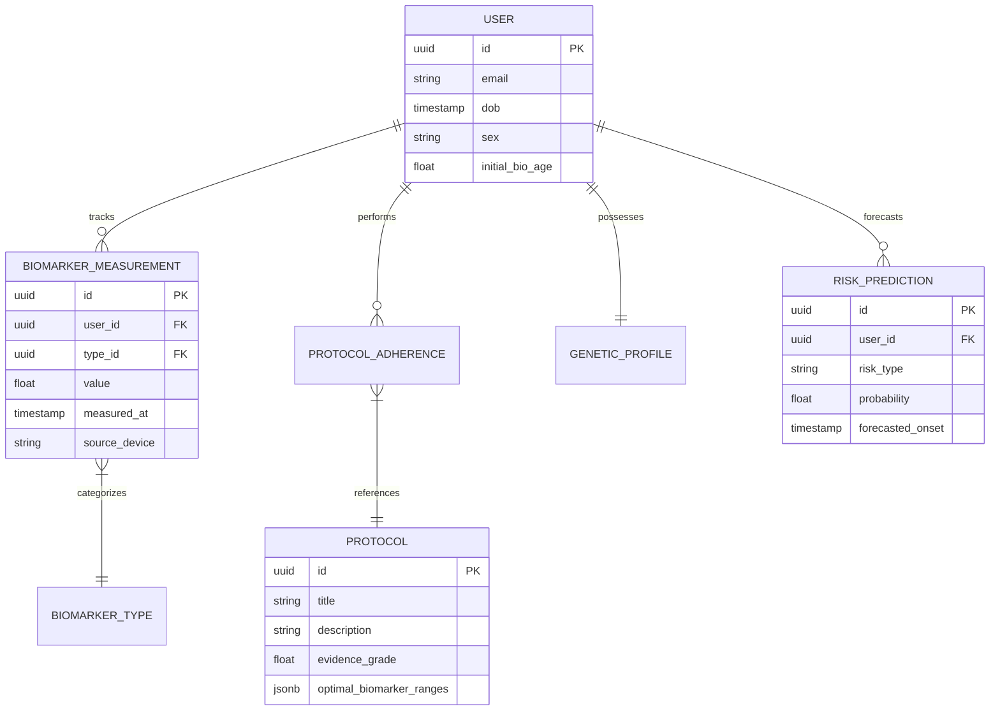

# Aeterna: The Biological Intelligence Engine (Longevity OS)

## SECTION 1 — PRODUCT VISION

### Mission Statement
To transition humanity from reactive healthcare to proactive biological optimization by providing a continuous, AI-driven "Biological Operating System" that maximizes healthspan and delays senescence.

### Product Philosophy
Aeterna is not a tracker; it is a **Closed-Loop Biological Optimization System**. It treats the human body as a complex, dynamic network of interacting subsystems. By applying control theory to physiology, we don't just observe trends—we intervene to maintain homeostasis at the most youthful state possible.

### Why Modern Healthcare Fails
1. **Reactive Bias**: We treat disease, not aging. 90% of healthcare costs go to chronic diseases that could be prevented decades earlier.
2. **Snapshot Data**: Yearly blood tests are "biomarker selfies." We need "biomarker cinema" (continuous data).
3. **Reference Ranges vs. Optimal Ranges**: Being "not sick" is not the same as being "optimized."

### The Science: Healthspan vs. Lifespan
While lifespan has increased, "sickspan" (years spent with chronic illness) has also increased. Aeterna focuses on **compression of morbidity**—living at peak physical and cognitive capacity until the very end.

---

## SECTION 2 — SYSTEM ARCHITECTURE

### High-Level Architecture
A microservices-based, event-driven ecosystem optimized for HIPAA compliance and massive time-series ingestion.

- **Orchestration Layer**: FastAPI (Async) / Kubernetes
- **Data Pipeline**: Kafka for real-time ingestion from wearables (Oura, Whoop, Dexcom).
- **Storage**:
    - **PostgreSQL**: Relational clinical data.
    - **TimescaleDB**: Time-series biomarker data.
    - **Neo4j**: Biological Memory Graph (Interactions between lifestyle, genetics, and outcomes).
    - **Pinecone/Milvus**: Vector storage for RAG (Medical research & personalized context).
- **AI Engine**: PyTorch/TensorFlow for aging models; LangGraph for health coaching.

### Architecture Diagram (Mermaid)

---

## SECTION 3 — BIOMARKER TRACKING SYSTEM

### Critical Biomarker Clusters
1. **Metabolic**: HbA1c, Fasting Insulin, Lipid Fractions (ApoB), Continuous Glucose (GVP).
2. **Inflammatory**: hs-CRP, IL-6, Homocysteine.
3. **Hormonal**: Free Testosterone, Cortisol (Diurnal), IGF-1, DHEA-S.
4. **Organ Function**: eGFR, ALT/AST, Cystatin C.
5. **Functional (Wearable)**: HRV (Autonomic Balance), VO2 Max, Sleep Architecture, RHR.

### Normalization & Baseline Modeling
We use **Bayesian Adaptive Baselines**. Instead of comparing a user to a global average, we compare them to their own "Youthful Baseline" and peer groups with optimal outcomes.

---

## SECTION 4 — BIOLOGICAL AGE ESTIMATION ENGINE (AeternaClock™)

### Multi-Modal Aging Approach
1. **PhenoAge/BioAge**: Derived from blood chemistry (Levine/Morgan models).
2. **Epigenetic Clock**: Integration with GrimAge/DunedinPACE via API.
3. **Functional Age**: VO2 Max, grip strength, and cognitive processing speed.
4. **AI Composite**: A neural network that weights these markers based on longitudinal mortality data.

---

## SECTION 5 — PERSONALIZED LONGEVITY PROTOCOL ENGINE

### Multi-Objective Optimization
The engine solves for:
`Max(Healthspan) where Stress < Recovery_Capacity AND Metabolic_Stability > Threshold`

### Intervention Categories
- **Pharma/Nutraceutical**: Rapamycin, Metformin, NAD+ precursors, tailored stacks.
- **Hormetic**: Sauna, Cold Plunge, Zone 2/5 Exercise.
- **Circadian**: Blue light management, meal timing (TRE).

---

## SECTION 10 — DATABASE SCHEMA & DATA ARCHITECTURE

### ER Diagram (Mermaid)

### Advanced Data Partitioning
For high-frequency wearable data (HRV, Glucose), we utilize **TimescaleDB hyper-tables**, partitioning by `measured_at` in 1-day chunks to ensure rapid query performance for longitudinal trend analysis.

### Vector Embedding Strategy
Medical literature (PubMed/bioRxiv) is chunked and stored as 1536-dimensional embeddings in **Pinecone**. This allows the AI Health Coach to perform semantically relevant RAG (Retrieval-Augmented Generation) based on the user's specific biomarker anomalies.

---

## SECTION 17 — INVESTOR PITCH: THE FUTURE OF HEALTH

### The Problem
Healthcare is "Sick-care." We wait for systemic failure before intervening. This is economically unsustainable and biologically inefficient.

### The Solution
Aeterna provides a **Biological Infrastructure Layer**. By quantifying aging in real-time, we enable a market for "Preventive Outcomes" rather than just "Treatment Services."

### Market Opportunity
- **TAM**: $600B+ (Longevity & Preventive Health)
- **Moat**: Proprietary longitudinal biological data graph and "Youthful Baseline" modeling.
- **Go-to-Market**: Direct-to-Consumer (D2C) Longevity Concierge -> Enterprise Wellness Integration -> Clinical Diagnostic Layer.

---

## SECTION 18 — 14-DAY MVP ROADMAP (The "Genesis" Sprint)

- **Day 1-3**: Finalize Biomarker Ingestion Schema & Oura/Dexcom API Auth.
- **Day 4-7**: Implement PhenoAge v1 and Anomaly Detection AI.
- **Day 8-10**: Build "Protocol Engine" v1 (Rule-based interventions).
- **Day 11-13**: High-fidelity Dashboard deployment (Next.js).
- **Day 14**: Pilot "Biological Audit" for first 100 users.
